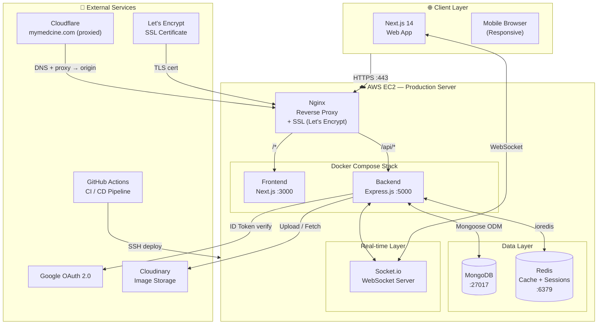
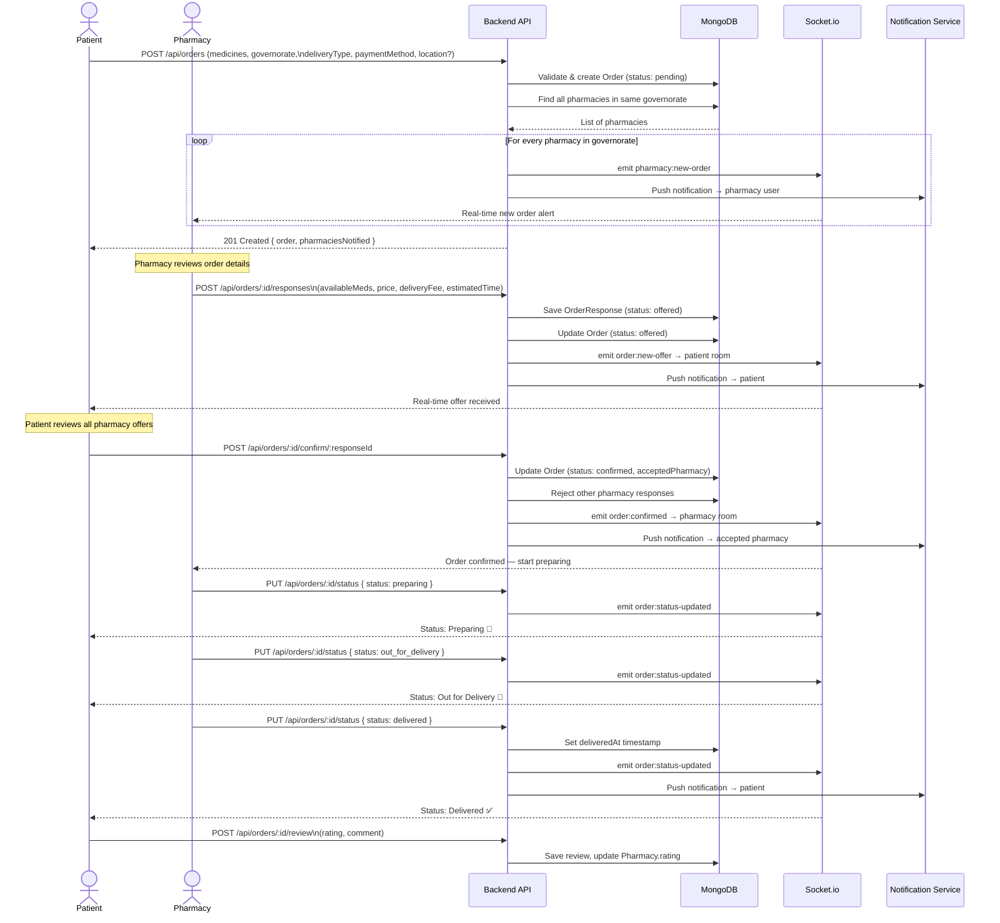
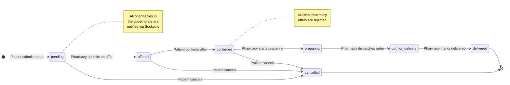
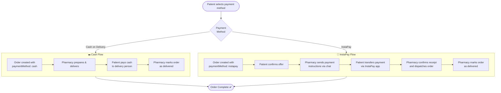
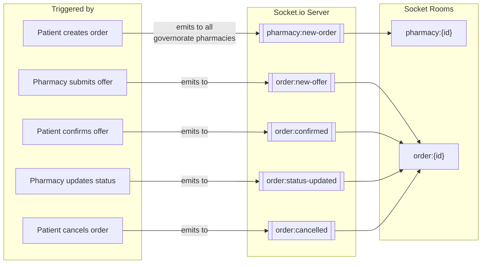
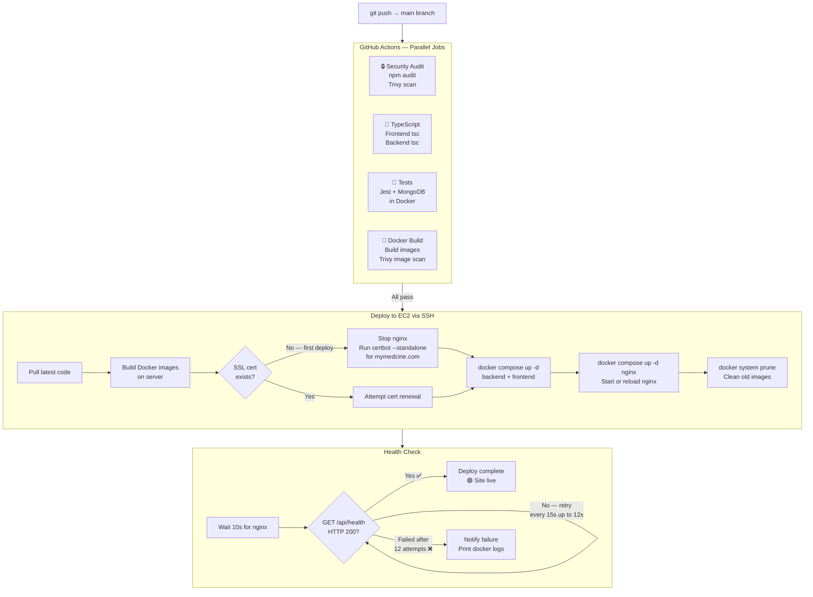
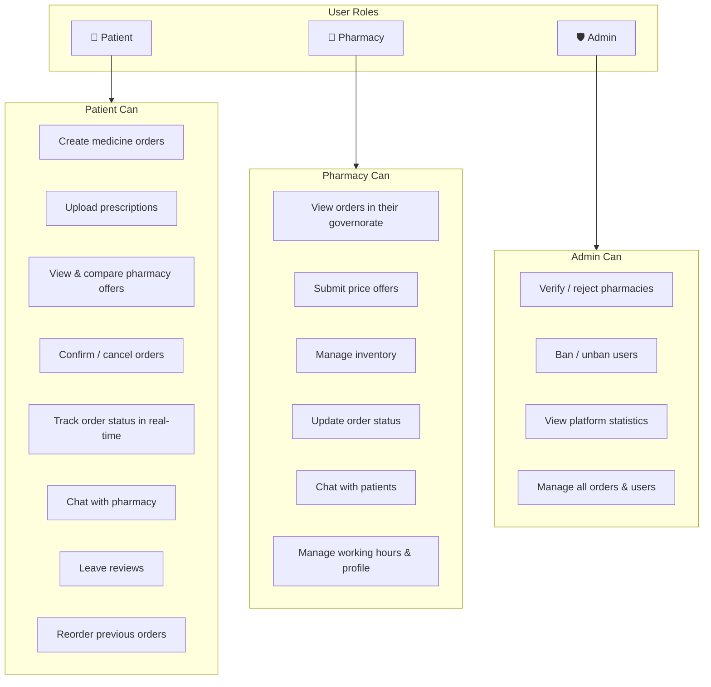

# PharmaLink — System Workflow

> End-to-end workflow covering authentication, order lifecycle, real-time events, and infrastructure.

---

## 1. System Architecture Overview



---

## 2. Authentication Flow

```mermaid
flowchart TD
    START([User visits site]) --> CHOICE{New or\nReturning?}

    CHOICE -->|New user| REGISTER
    CHOICE -->|Returning| LOGIN

    subgraph REGISTER["Registration"]
        R1[Select role\nPatient / Pharmacy] --> R2{OAuth or\nEmail?}
        R2 -->|Google OAuth\nPatient only| R3[Google Sign-In popup]
        R2 -->|Email & Password| R4[Fill registration form]
        R3 --> R5[Send ID Token to\nPOST /api/auth/google]
        R4 --> R6[POST /api/auth/register]
        R5 --> VERIFY
        R6 --> VERIFY
    end

    subgraph LOGIN["Login"]
        L1{OAuth or\nEmail?}
        L1 -->|Google| L2[Google Sign-In popup]
        L1 -->|Email| L3[Email + Password form]
        L2 --> L4[POST /api/auth/google]
        L3 --> L5[POST /api/auth/login]
        L4 --> VERIFY
        L5 --> VERIFY
    end

    subgraph VERIFY["Backend Verification"]
        V1[Validate credentials\nor verify Google ID token]
        V1 --> V2{Valid?}
        V2 -->|No| V3[Return 401 error]
        V2 -->|Yes| V4[Issue Access Token\n+ Refresh Token JWT]
    end

    V4 --> STORE[Store tokens in\nlocalStorage]
    STORE --> ROLE{User role?}
    ROLE -->|patient| P[/patient/dashboard]
    ROLE -->|pharmacy| PH[/pharmacy/dashboard]
    ROLE -->|admin| A[/admin/dashboard]

    V3 --> LOGIN
```

---

## 3. Order Lifecycle — Sequence Diagram



---

## 4. Order Status State Machine



---

## 5. Payment Flow



---

## 6. Real-time Socket.io Event Map



---

## 7. CI/CD Pipeline



---

## 8. User Roles & Permissions


