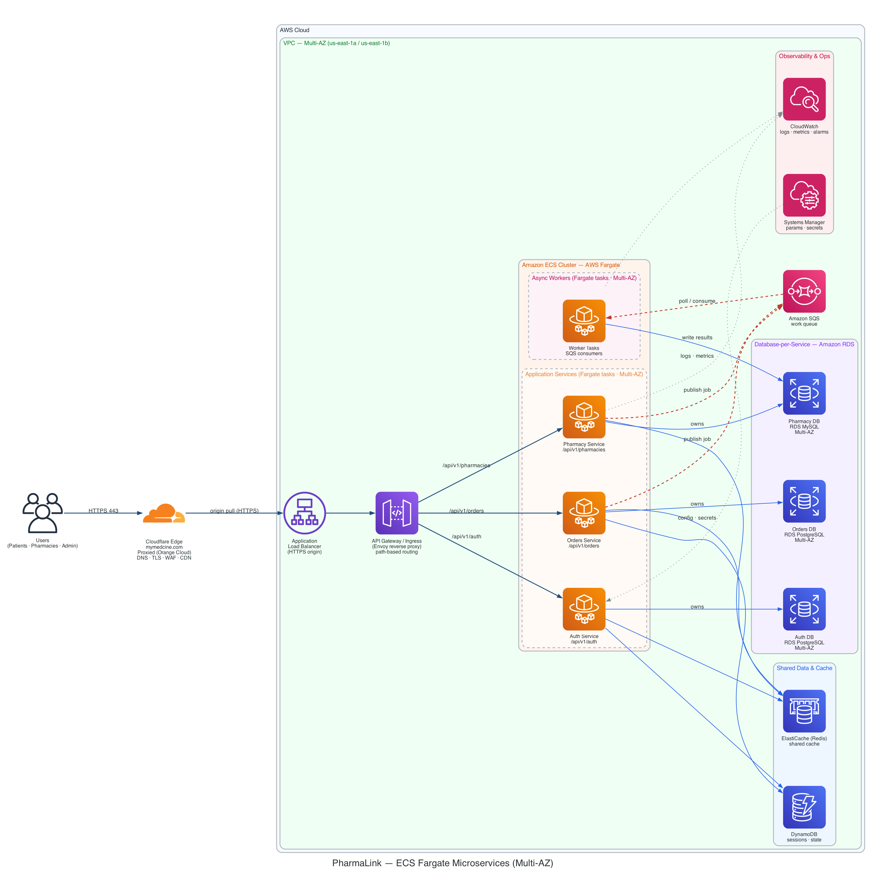
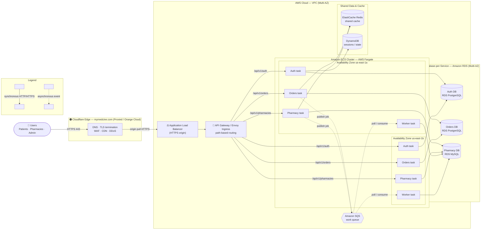

# PharmaLink — Production Architecture (ECS Fargate Microservices)

> Refactor of the original EC2 Auto Scaling Group design into a modern,
> production-grade microservices architecture on **Amazon ECS / AWS Fargate**,
> fronted by **Cloudflare** (`mymedcine.com`, proxied / orange cloud).



---

## 1. What changed vs. the original design

| Concern | Before (legacy) | After (this design) |
|---|---|---|
| **Edge / DNS** | Route 53 → CloudFront → ALB | **Cloudflare only** (`mymedcine.com`, orange cloud) → ALB. No Route 53, no CloudFront. |
| **Compute** | EC2 Auto Scaling Groups (Web + Worker tiers) | **Amazon ECS Cluster on AWS Fargate** — each service is isolated Fargate tasks, spread Multi-AZ. |
| **Ingress / routing** | ALB → web instances | ALB → **API Gateway / Envoy ingress** doing path-based routing (`/api/v1/orders` → Orders service). |
| **Database** | Single sharded SQL tier + middleware (Vitess) | **Database-per-service** — one isolated Amazon RDS per microservice. |
| **Workers** | EC2 ASG worker tier | **Fargate worker tasks** consuming SQS natively. |
| **Cache / sessions / queue** | ElastiCache + DynamoDB + SQS | **Unchanged** — kept as shared infrastructure. |
| **Observability** | CloudWatch + Systems Manager | **Unchanged.** |

---

## 2. Components

### Kept intact
- **Cloudflare** — DNS for `mymedcine.com`, TLS termination, WAF, CDN, DDoS protection. Proxied (orange cloud), origin-pulling to the ALB over HTTPS.
- **Amazon ElastiCache (Redis)** — shared cache across all services.
- **Amazon DynamoDB** — session / state store.
- **Amazon SQS** — async message queue decoupling the request path from heavy workloads.
- **CloudWatch** + **Systems Manager** — logs, metrics, alarms, parameters/secrets.

### Refactored
- **Application Load Balancer** — the single AWS entry point behind Cloudflare; HTTPS target group.
- **API Gateway / Envoy ingress** — path-based routing to services. (Either a managed API Gateway, or a lightweight Envoy/Nginx reverse proxy running as an ECS task — the diagram shows the logical role; pick one at implementation time.)
- **Amazon ECS Cluster (AWS Fargate)** — serverless containers, no EC2 to manage. Services:
  - **Auth Service** — `/api/v1/auth`
  - **Orders Service** — `/api/v1/orders`
  - **Pharmacy Service** — `/api/v1/pharmacies`
  - **Worker tasks** — SQS consumers for async pharmacy workloads
  - Every service runs ≥2 tasks spread across **us-east-1a / us-east-1b** (Multi-AZ).
- **Database-per-service (Amazon RDS)** — each service privately owns its database; no cross-service DB access:
  - Auth DB → RDS **PostgreSQL** (Multi-AZ)
  - Orders DB → RDS **PostgreSQL** (Multi-AZ)
  - Pharmacy DB → RDS **MySQL** (Multi-AZ)

---

## 3. Traffic flows

**Synchronous (HTTP/HTTPS — solid blue):**
```
Users → Cloudflare (TLS) → ALB → API Gateway/Ingress → {Auth|Orders|Pharmacy} service
service → its own RDS database            (read/write)
service → ElastiCache (Redis)             (cache)
auth/orders → DynamoDB                     (sessions/state)
```

**Asynchronous (event-driven — dashed red):**
```
Orders / Pharmacy service → SQS  (publish job)
SQS → Worker tasks               (poll / consume)
Worker → Pharmacy DB             (write processed results)
```

**Telemetry / config (dotted grey):**
```
services + workers → CloudWatch   (logs · metrics · alarms)
Systems Manager → services        (parameters · secrets)
```

---

## 4. Detailed Multi-AZ view (Mermaid)

The PNG above shows one logical node per service for legibility. This view
expands the **Multi-AZ task spread** and the **database-per-service** ownership.
Solid arrows = synchronous; dotted arrows = asynchronous (SQS).



> Cache / session edges are drawn from one representative task per service to
> keep the graph readable — **all** AZ-a and AZ-b tasks share the same Redis,
> DynamoDB, SQS and RDS endpoints.

---

## 5. Why these choices

- **Cloudflare at the edge (no Route 53 / CloudFront).** DNS, TLS, caching, WAF
  and DDoS all live at Cloudflare. AWS sees only Cloudflare's origin pulls, so
  Route 53 and CloudFront would be redundant cost and a second edge to operate.
- **Fargate over EC2 ASG.** No instance fleet to patch or scale; per-task
  isolation; scale each service independently on its own CPU/memory and request
  metrics.
- **API Gateway / Envoy ingress.** Centralizes path-based routing, auth, rate
  limiting and request shaping so services stay focused on domain logic.
- **Database-per-service (not Vitess sharding).** Each service owns its schema
  and can evolve, scale and fail independently. Removes the shared-shard
  blast-radius and the operational weight of a sharding middleware tier.
- **SQS + Fargate workers.** Heavy/slow pharmacy workloads run off the request
  path; the queue absorbs spikes and lets the worker tier scale on queue depth.

---

## 6. Implementation notes (ties to this repo)

- **DNS migration:** done — `docker-compose.prod.yml`, `nginx/nginx.conf`,
  `.github/workflows/cd.yml`, `.env.prod`, `scripts/seed-pharmacies.mjs`,
  `WORKFLOW.md` and `docs/user-lifecycle.html` now use `mymedcine.com` (the old
  `mymedcine.duckdns.org` / raw-IP references were removed).
- **TLS with orange-cloud proxying:** because Cloudflare terminates TLS at the
  edge, the origin should use a **Cloudflare Origin Certificate** (or ACM on the
  ALB) and Cloudflare SSL mode **Full (strict)** — the Let's Encrypt/`certbot`
  `--standalone` step in the current CD pipeline is unnecessary in the proxied
  model.
- **Lock the origin to Cloudflare:** restrict the ALB/EC2 security group ingress
  to [Cloudflare's published IP ranges](https://www.cloudflare.com/ips/) so the
  origin can't be reached directly, bypassing the WAF.
  `terraform/security.tf` already notes this.

---

## 7. Regenerating the diagram

The PNG is generated from `pharmalink_ecs_fargate.py` using the
[`diagrams`](https://diagrams.mingrammer.com/) library (official AWS icons) +
Graphviz.

```bash
# one-time deps (macOS)
brew install graphviz
pip install diagrams

# render docs/architecture/pharmalink-ecs-fargate.png
python3 docs/architecture/pharmalink_ecs_fargate.py
```
